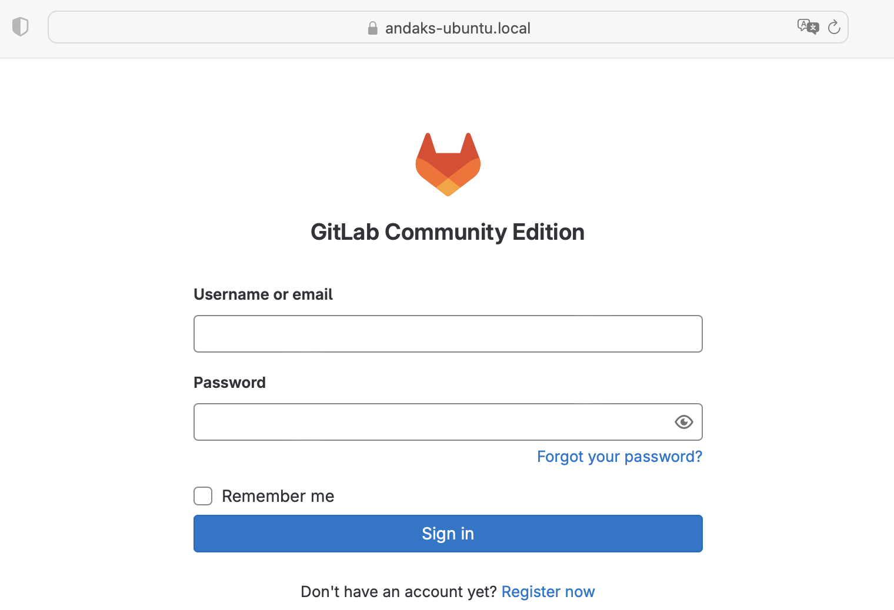
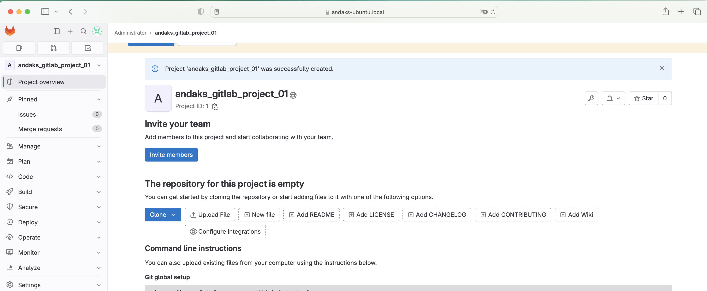
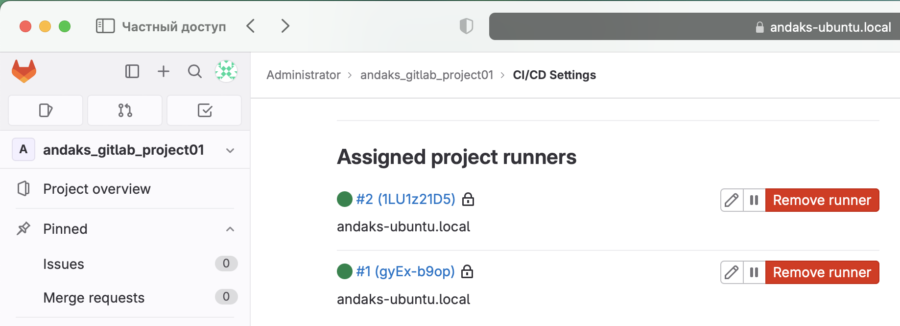

# Домашнее задание к занятию "`GitLab`" - `Андрей Аксенов`

### Инструкция по выполнению домашнего задания

Сделайте fork репозитория c шаблоном решения к себе в GitHub и переименуйте его по названию или номеру занятия, например, https://github.com/имя-вашего-репозитория/gitlab-hw или https://github.com/имя-вашего-репозитория/8-03-hw.
Выполните клонирование этого репозитория к себе на ПК с помощью команды git clone.
Выполните домашнее задание и заполните у себя локально этот файл README.md:
впишите сверху название занятия, ваши фамилию и имя;
в каждом задании добавьте решение в требуемом виде — текст, код, скриншоты, ссылка.
для корректного добавления скриншотов используйте инструкцию «Как вставить скриншот в шаблон с решением»;
при оформлении используйте возможности языка разметки md. Коротко об этом можно посмотреть в инструкции по MarkDown.
После завершения работы над домашним заданием сделайте коммит git commit -m "comment" и отправьте его на GitHub git push origin.
Для проверки домашнего задания в личном кабинете прикрепите и отправьте ссылку на решение в виде md-файла в вашем GitHub.
Любые вопросы по выполнению заданий задавайте в чате учебной группы или в разделе «Вопросы по заданию» в личном кабинете.
Желаем успехов в выполнении домашнего задания!

#### Задание 1

Что нужно сделать:

1. Разверните GitLab локально, используя Vagrantfile и инструкцию, описанные в этом репозитории.
2. Создайте новый проект и пустой репозиторий в нём.
3. Зарегистрируйте gitlab-runner для этого проекта и запустите его в режиме Docker. Раннер можно регистрировать и запускать на той же виртуальной машине, на которой запущен GitLab.

В качестве ответа в репозиторий шаблона с решением добавьте скриншоты с настройками раннера в проекте.

#### Ответ на задание 1.

1. Gitlab установлен

2. Проект и репозиторий созданы

3. gitlab-runner

---
 
#### Задание 2

Что нужно сделать:

1. Запушьте репозиторий на GitLab, изменив origin. Это изучалось на занятии по Git.
2. Создайте .gitlab-ci.yml, описав в нём все необходимые, на ваш взгляд, этапы.

В качестве ответа в шаблон с решением добавьте:
* файл gitlab-ci.yml для своего проекта или вставьте код в соответствующее поле в шаблоне;
* скриншоты с успешно собранными сборками.

#### Ответ на задание 2.

---

### Дополнительные задания* (со звёздочкой).

Их выполнение необязательное и не влияет на получение зачёта по домашнему заданию. Можете их решить, если хотите лучше разобраться в материале.

---

#### Задание 3

Измените CI так, чтобы:
* этап сборки запускался сразу, не дожидаясь результатов тестов;
* тесты запускались только при изменении файлов с расширением *.go.
В качестве ответа добавьте в шаблон с решением файл gitlab-ci.yml своего проекта или вставьте код в соответсвующее поле в шаблоне.
